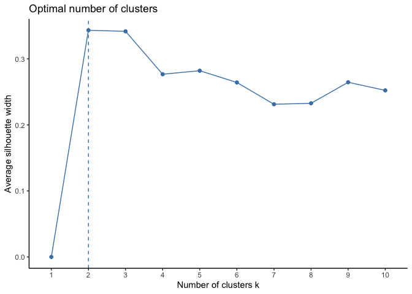
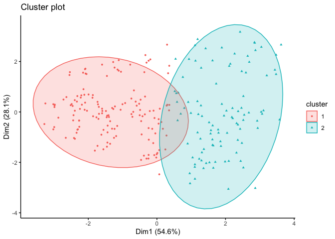

Clara Clustering in R
================
2023-03-15

Import and scale data

``` r
# import data set 
buddymove = read.csv("~/Documents/Langara /Semester 3/DANA 4840 Classification II/Activities/Kmeans Clustering/buddymove_holidayiq.csv", stringsAsFactors=TRUE)
head(buddymove)
```

    ##   User.Id Sports Religious Nature Theatre Shopping Picnic
    ## 1  User 1      2        77     79      69       68     95
    ## 2  User 2      2        62     76      76       69     68
    ## 3  User 3      2        50     97      87       50     75
    ## 4  User 4      2        68     77      95       76     61
    ## 5  User 5      2        98     54      59       95     86
    ## 6  User 6      3        52    109      93       52     76

``` r
# scale data
df =  scale(buddymove[,2:7])
head(df)
```

    ##         Sports  Religious     Nature    Theatre   Shopping     Picnic
    ## [1,] -1.509552 -1.0100142 -0.9973422 -1.4744331 -1.0740003 -0.7783943
    ## [2,] -1.509552 -1.4722052 -1.0630749 -1.2565864 -1.0499404 -1.6057691
    ## [3,] -1.509552 -1.8419580 -0.6029459 -0.9142560 -1.5070790 -1.3912645
    ## [4,] -1.509552 -1.2873288 -1.0411640 -0.6652884 -0.8815209 -1.8202736
    ## [5,] -1.509552 -0.3629468 -1.5451149 -1.7856426 -0.4243823 -1.0541859
    ## [6,] -1.358415 -1.7803325 -0.3400150 -0.7275303 -1.4589591 -1.3606210

Determine optimal number of clusters

``` r
# optimal number of clusters : 2 
library(cluster)
library(ggplot2)
library(factoextra)
```

    ## Welcome! Want to learn more? See two factoextra-related books at https://goo.gl/ve3WBa

``` r
fviz_nbclust(df, clara, method = "silhouette")+
  theme_classic()
```

<!-- -->

Compute clustering using 50 samples

``` r
#compute Clara: 50 samples 
clara.res <- clara(df, 2, samples = 50, pamLike = TRUE)

# Medoids
clara.res$medoids
```

    ##          Sports  Religious     Nature    Theatre   Shopping     Picnic
    ## [1,] -0.9050028 -0.3629468 -0.4495696 -0.2295951 -0.5206220 -0.5945333
    ## [2,]  1.2109193  1.0236262  0.3173122  0.7040334  0.6342544  0.8457116

``` r
# row of medioid
all = c(-0.9050028 ,-0.3629468, -0.4495696, -0.2295951, -0.5206220 ,-0.5945333)
which(Reduce('&', Map ('==', df, all)))
```

    ## integer(0)

``` r
# visualization
fviz_cluster(clara.res,
             ellipse.type = "t", # Concentration ellipse
             geom = "point", pointsize = 1,
             ggtheme = theme_classic()
)
```

<!-- -->

Compute clustering using 150 samples

``` r
####### compute Clara: 150 samples ########
clara.res2 <- clara(df, 2, samples = 150, pamLike = TRUE)

# summary of clustering 
print(clara.res2)
```

    ## Call:     clara(x = df, k = 2, samples = 150, pamLike = TRUE) 
    ## Medoids:
    ##          Sports  Religious     Nature    Theatre   Shopping     Picnic
    ## [1,] -0.9050028 -0.3629468 -0.4495696 -0.2295951 -0.5206220 -0.5945333
    ## [2,]  1.2109193  1.0236262  0.3173122  0.7040334  0.6342544  0.8457116
    ## Objective function:   1.80886
    ## Clustering vector:    int [1:249] 1 1 1 1 1 1 1 1 1 1 1 1 1 1 1 1 1 1 ...
    ## Cluster sizes:            148 101 
    ## Best sample:
    ##  [1]   7   9  12  29  33  39  43  46  64  69  73  74  75  86  98 102 103 116 126
    ## [20] 129 132 134 139 141 142 146 152 153 155 164 166 170 184 192 204 206 213 218
    ## [39] 233 236 238 244 245 246
    ## 
    ## Available components:
    ##  [1] "sample"     "medoids"    "i.med"      "clustering" "objective" 
    ##  [6] "clusinfo"   "diss"       "call"       "silinfo"    "data"

``` r
# Medoids
clara.res2$medoids
```

    ##          Sports  Religious     Nature    Theatre   Shopping     Picnic
    ## [1,] -0.9050028 -0.3629468 -0.4495696 -0.2295951 -0.5206220 -0.5945333
    ## [2,]  1.2109193  1.0236262  0.3173122  0.7040334  0.6342544  0.8457116

``` r
# visualization
fviz_cluster(clara.res2,
             ellipse.type = "t", # Concentration ellipse
             geom = "point", pointsize = 1,
             ggtheme = theme_classic()
)
```

<!-- -->
