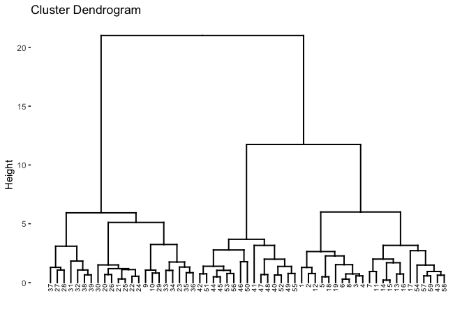
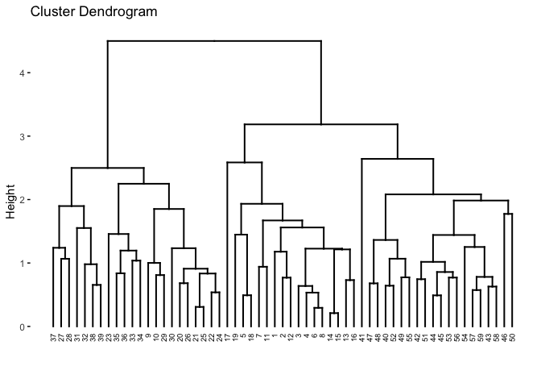
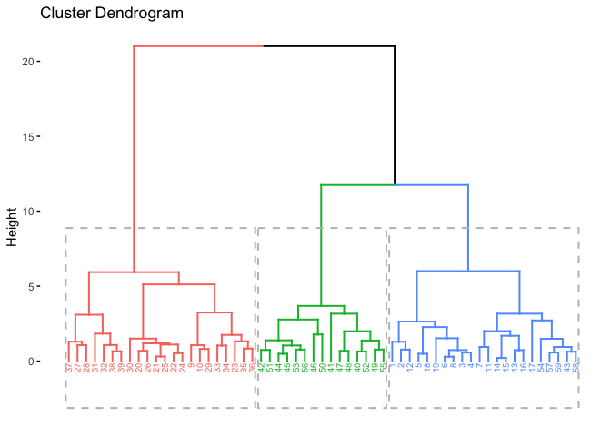
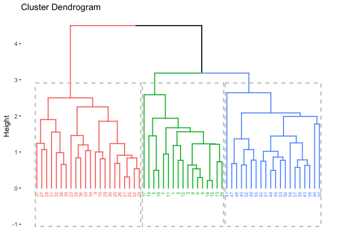

Hierarchical clustering in R
================
2023-02-17

``` r
#import dataset
seeds = read.csv("~/Documents/Langara /Semester 3/DANA 4840 Classification II/Activities/Hierarchiacal/seeds.csv", stringsAsFactors=TRUE)
attach(seeds)
#detach(seeds)

#summary statistics
summary(seeds)
```

    ##       area         perimeter      compactness     kernel_length  
    ##  Min.   :10.59   Min.   :12.41   Min.   :0.8198   Min.   :4.899  
    ##  1st Qu.:12.34   1st Qu.:13.46   1st Qu.:0.8611   1st Qu.:5.236  
    ##  Median :14.59   Median :14.21   Median :0.8779   Median :5.482  
    ##  Mean   :15.05   Mean   :14.62   Mean   :0.8753   Mean   :5.636  
    ##  3rd Qu.:17.19   3rd Qu.:15.70   3rd Qu.:0.8893   3rd Qu.:6.011  
    ##  Max.   :21.18   Max.   :17.23   Max.   :0.9183   Max.   :6.579  
    ##   kernel_width     asymmetry     kernel_groove  
    ##  Min.   :2.630   Min.   :1.018   Min.   :4.649  
    ##  1st Qu.:2.996   1st Qu.:2.700   1st Qu.:4.957  
    ##  Median :3.333   Median :4.076   Median :5.175  
    ##  Mean   :3.297   Mean   :3.867   Mean   :5.398  
    ##  3rd Qu.:3.562   3rd Qu.:4.966   3rd Qu.:5.878  
    ##  Max.   :4.033   Max.   :7.524   Max.   :6.498

``` r
apply(seeds,2,var)
```

    ##          area     perimeter   compactness kernel_length  kernel_width 
    ##  9.0633704267  1.8843372881  0.0004932541  0.2223362677  0.1434075611 
    ##     asymmetry kernel_groove 
    ##  2.1303041479  0.2989531531

``` r
head(seeds)
```

    ##    area perimeter compactness kernel_length kernel_width asymmetry
    ## 1 15.26     14.84      0.8710         5.763        3.312     2.221
    ## 2 14.88     14.57      0.8811         5.554        3.333     1.018
    ## 3 14.29     14.09      0.9050         5.291        3.337     2.699
    ## 4 13.84     13.94      0.8955         5.324        3.379     2.259
    ## 5 16.14     14.99      0.9034         5.658        3.562     1.355
    ## 6 14.38     14.21      0.8951         5.386        3.312     2.462
    ##   kernel_groove
    ## 1         5.220
    ## 2         4.956
    ## 3         4.825
    ## 4         4.805
    ## 5         5.175
    ## 6         4.956

``` r
#standardise data
seeds = scale(seeds)
head(seeds)
```

    ##             area  perimeter compactness kernel_length kernel_width  asymmetry
    ## [1,]  0.06992375  0.1591555  -0.1926966    0.26858373   0.04077372 -1.1277982
    ## [2,] -0.05629932 -0.0375355   0.2620674   -0.17465850   0.09622777 -1.9520213
    ## [3,] -0.25227724 -0.3872084   1.3381920   -0.73242265   0.10679045 -0.8003013
    ## [4,] -0.40175192 -0.4964811   0.9104437   -0.66243703   0.21769855 -1.1017629
    ## [5,]  0.36222980  0.2684282   1.2661502    0.04590222   0.70094098 -1.7211292
    ## [6,] -0.22238230 -0.2997901   0.8924332   -0.53094891   0.04077372 -0.9626795
    ##      kernel_groove
    ## [1,]    -0.3261395
    ## [2,]    -0.8089785
    ## [3,]    -1.0485691
    ## [4,]    -1.0851478
    ## [5,]    -0.4084416
    ## [6,]    -0.8089785

``` r
# dissimilarity matrix using euclidean
res.dist = dist(seeds, method = "euclidean")

#hierarchical clustering 
ward_hc =   hclust(d = res.dist, method = "ward.D2") 
average_hc = hclust(d = res.dist, method = "average") 

#dendograms
library(ggplot2)
library("factoextra")
```

    ## Welcome! Want to learn more? See two factoextra-related books at https://goo.gl/ve3WBa

``` r
#ward.D2
fviz_dend(ward_hc, cex = 0.5)
```

    ## Warning: The `<scale>` argument of `guides()` cannot be `FALSE`. Use "none" instead as
    ## of ggplot2 3.3.4.
    ## ℹ The deprecated feature was likely used in the factoextra package.
    ##   Please report the issue at <]8;;https://github.com/kassambara/factoextra/issueshttps://github.com/kassambara/factoextra/issues]8;;>.

<!-- -->

``` r
#average
fviz_dend(average_hc, cex = 0.5)
```

<!-- -->

``` r
#cophenetic distances
ward_coph = cophenetic(ward_hc)
average_coph = cophenetic(average_hc)

# Correlation between cophenetic distance and the original distance

#ward
cor(res.dist, ward_coph)
```

    ## [1] 0.7394543

``` r
#average
cor(res.dist, average_coph)
```

    ## [1] 0.7532472

``` r
#### Cut tree into 3 groups
## Ward
grp_ward = cutree(ward_hc, k = 3)
head(grp_ward, n = 3)
```

    ## [1] 1 1 1

``` r
# Number of members in each cluster
table(grp_ward)
```

    ## grp_ward
    ##  1  2  3 
    ## 22 22 15

``` r
# Get the names for the 

# Cut in 4 groups and color by groups
fviz_dend(ward_hc, k = 3, # Cut in four groups
          cex = 0.5, # label size
          color_labels_by_k = TRUE, # color labels by groups
          rect = TRUE # Add rectangle around groups
)
```

<!-- -->

``` r
## Average

grp_average = cutree(average_hc, k = 3)
head(grp_average, n = 3)
```

    ## [1] 1 1 1

``` r
# Number of members in each cluster
table(grp_average)
```

    ## grp_average
    ##  1  2  3 
    ## 17 22 20

``` r
# Get the names for the 

# Cut in 4 groups and color by groups
fviz_dend(average_hc, k = 3, # Cut in four groups
          cex = 0.5, # label size
          color_labels_by_k = TRUE, # color labels by groups
          rect = TRUE # Add rectangle around groups
)
```

<!-- -->
