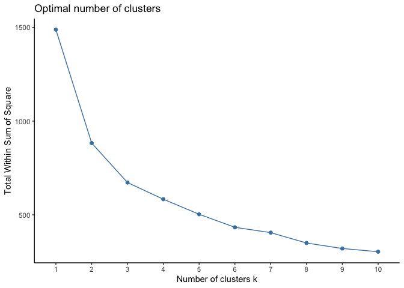
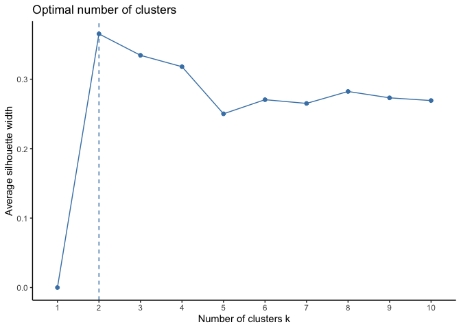
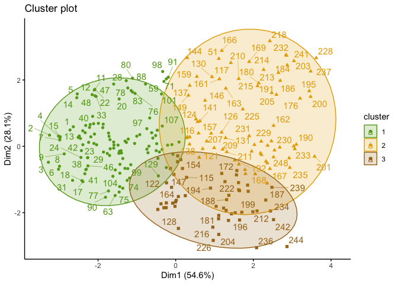
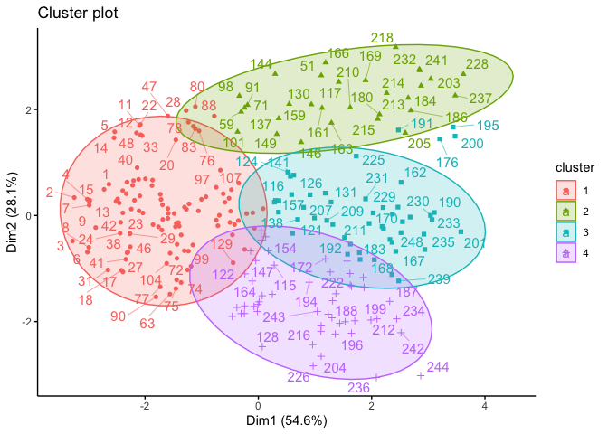
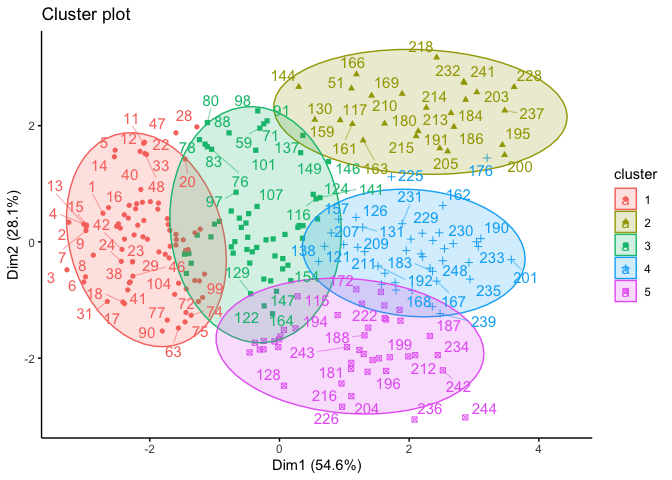

K-medoids Clustering in R
================
2023-03-20

In this R notebook, we will explore the use of k-medoids clustering as a
technique for unsupervised learning. Specifically, we will apply
k-medoids clustering to a dataset and examine the results of clustering
using 3, 4, and 5 clusters.

``` r
# import data set
buddymove = read.csv("~/Documents/Langara /Semester 3/DANA 4840 Classification II/Activities/Kmeans Clustering/buddymove_holidayiq.csv", stringsAsFactors=TRUE)
head(buddymove)
```

    ##   User.Id Sports Religious Nature Theatre Shopping Picnic
    ## 1  User 1      2        77     79      69       68     95
    ## 2  User 2      2        62     76      76       69     68
    ## 3  User 3      2        50     97      87       50     75
    ## 4  User 4      2        68     77      95       76     61
    ## 5  User 5      2        98     54      59       95     86
    ## 6  User 6      3        52    109      93       52     76

``` r
# scale data
data_scaled =  scale(buddymove[,2:7])
#head(data_scaled)

#optimal number of clusters
library(cluster)
library(factoextra)
```

    ## Loading required package: ggplot2

    ## Welcome! Want to learn more? See two factoextra-related books at https://goo.gl/ve3WBa

``` r
fviz_nbclust(data_scaled, pam, method = "wss")+
  theme_classic()
```

<!-- -->

``` r
# another method : silhouette look for the highest point 
fviz_nbclust(data_scaled, pam, method = "silhouette")+theme_classic()
```

<!-- -->

K-medoids using 3 Clusters

``` r
#### 3 clusters 
library(cluster)
pam.res <- pam(data_scaled, 3)

#Cluster medoids
pam.res$medoids
```

    ##          Sports  Religious     Nature    Theatre   Shopping     Picnic
    ## [1,] -0.9050028 -0.8251378 -0.4714805 -0.5719256 -0.3281426 -0.9316119
    ## [2,]  0.9086447  1.1468772  0.4268667  0.3928239  0.8748537  0.7231376
    ## [3,]  0.9086447 -0.4861977  1.3909466  0.9841219 -0.3281426  0.5699200

``` r
# visualizations 
fviz_cluster(pam.res,
             palette = c("#66A61E" ,"#E6AB02", "#A6761D" ),
             ellipse.type = "t", # Concentration ellipse
             repel = T, # Avoid label overplotting (slow)
             ggtheme = theme_classic()
)
```

    ## Warning: ggrepel: 121 unlabeled data points (too many overlaps). Consider
    ## increasing max.overlaps

<!-- -->

``` r
# number of data points in a cluster
table(pam.res$clustering)
```

    ## 
    ##   1   2   3 
    ## 120  75  54

``` r
# 
aggregate(buddymove[,2:7] , by = list(cluster = pam.res$cluster), mean)
```

    ##   cluster    Sports Religious   Nature  Theatre  Shopping   Picnic
    ## 1       1  6.108333  90.45000 100.9250  98.3000  89.73333  95.9500
    ## 2       2 17.653333 148.36000 118.8667 126.8000 159.62667 146.3333
    ## 3       3 17.185185  99.14815 184.7963 142.0741  98.27778 138.7222

K-medoids using 4 Clusters

``` r
#### 4 clusters 
library(cluster)
pam.res2 <- pam(data_scaled, 4)

#Cluster medoids
pam.res2$medoids
```

    ##          Sports  Religious     Nature    Theatre   Shopping     Picnic
    ## [1,] -0.9050028 -0.8251378 -0.4714805 -0.5719256 -0.3281426 -0.9316119
    ## [2,]  0.3040955  1.6398809 -1.2164513 -0.6964094  1.8131908  0.6924941
    ## [3,]  1.2109193  1.0236262  0.3173122  0.7040334  0.6342544  0.8457116
    ## [4,]  0.9086447 -0.4861977  1.3909466  0.9841219 -0.3281426  0.5699200

``` r
# visualizations 
fviz_cluster(pam.res2,
             ellipse.type = "t", # Concentration ellipse
             repel = TRUE, # Avoid label overplotting (slow)
             ggtheme = theme_classic()
)
```

    ## Warning: ggrepel: 117 unlabeled data points (too many overlaps). Consider
    ## increasing max.overlaps

<!-- -->

K-medoids using 5 Clusters

``` r
#### 5 clusters 
library(cluster)
pam.res3 <- pam(data_scaled, 5)

#Cluster medoids
pam.res3$medoids
```

    ##          Sports  Religious      Nature    Theatre   Shopping     Picnic
    ## [1,] -1.0561401 -0.8251378 -0.55912409 -0.8520141 -0.9296407 -0.9009684
    ## [2,]  0.9086447  1.9480083 -0.88778768 -0.5408046  1.9334904  1.1521467
    ## [3,] -0.3004537 -0.3937595 -0.03326234 -0.2607161  0.1530559 -0.2880982
    ## [4,]  1.2109193  1.0236262  0.31731216  0.7040334  0.6342544  0.8457116
    ## [5,]  0.9086447 -0.4861977  1.39094656  0.9841219 -0.3281426  0.5699200

``` r
# visualizations 
fviz_cluster(pam.res3,
             ellipse.type = "t", # Concentration ellipse
             repel = TRUE, # Avoid label overplotting (slow)
             ggtheme = theme_classic()
)
```

    ## Warning: ggrepel: 117 unlabeled data points (too many overlaps). Consider
    ## increasing max.overlaps

<!-- -->
