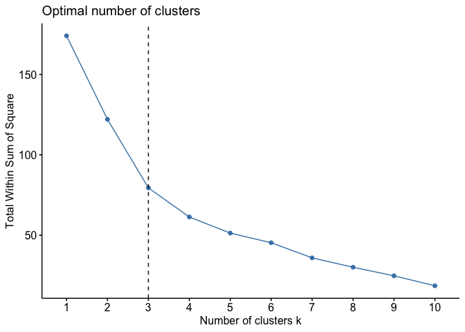
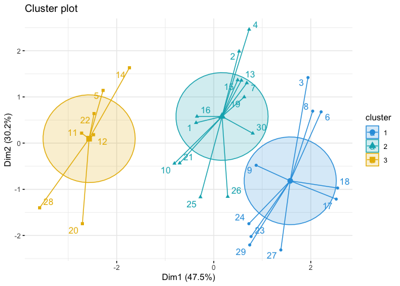
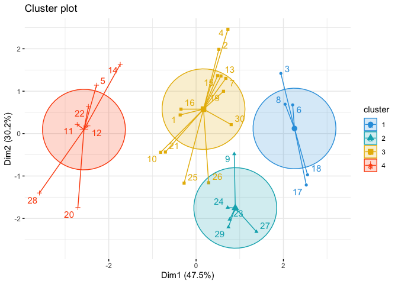
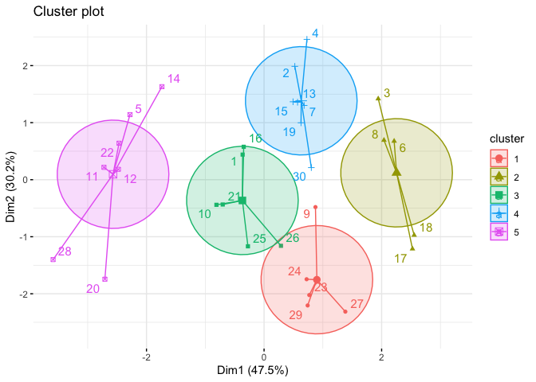

K means Clustering in R
================
2023-02-04

In this R notebook, we will explore the use of k-means clustering as a
technique for unsupervised learning. Specifically, we will apply k-means
clustering to a dataset and examine the results of clustering using 3,
4, and 5 clusters.

``` r
# import data set
buddymove_holidayiq = read.csv("~/Documents/Langara /Semester 3/DANA 4840 Classification II/Activities/Kmeans Clustering/buddymove_holidayiq.csv", stringsAsFactors=TRUE)
attach(buddymove_holidayiq)

# view data set
head(buddymove_holidayiq)
```

    ##   User.Id Sports Religious Nature Theatre Shopping Picnic
    ## 1  User 1      2        77     79      69       68     95
    ## 2  User 2      2        62     76      76       69     68
    ## 3  User 3      2        50     97      87       50     75
    ## 4  User 4      2        68     77      95       76     61
    ## 5  User 5      2        98     54      59       95     86
    ## 6  User 6      3        52    109      93       52     76

``` r
# remove first column
data = buddymove_holidayiq[1:30,-c(1)]
head(data)
```

    ##   Sports Religious Nature Theatre Shopping Picnic
    ## 1      2        77     79      69       68     95
    ## 2      2        62     76      76       69     68
    ## 3      2        50     97      87       50     75
    ## 4      2        68     77      95       76     61
    ## 5      2        98     54      59       95     86
    ## 6      3        52    109      93       52     76

``` r
#scale data 
data_scaled = scale(data)
head(data_scaled)
```

    ##       Sports   Religious     Nature    Theatre    Shopping      Picnic
    ## 1 -1.4466673 -0.08420654 -0.3809810 -0.7600042 -0.40226206  0.74708109
    ## 2 -1.4466673 -0.84206543 -0.5017144 -0.2960481 -0.35239486 -1.30422630
    ## 3 -1.4466673 -1.44835254  0.3434194  0.4330256 -1.29987162 -0.77240587
    ## 4 -1.4466673 -0.53892188 -0.4614699  0.9632611 -0.00332448 -1.83604674
    ## 5 -1.4466673  0.97679590 -1.3870926 -1.4227985  0.94415228  0.06331196
    ## 6 -0.5609526 -1.34730469  0.8263530  0.8307022 -1.20013722 -0.69643152

``` r
library(factoextra)
```

    ## Loading required package: ggplot2

    ## Welcome! Want to learn more? See two factoextra-related books at https://goo.gl/ve3WBa

``` r
fviz_nbclust(data_scaled, kmeans, method = "wss") + geom_vline(xintercept = 3, linetype = 2)
```

<!-- -->

K-means with 3 clusters

``` r
####### 3 clusters #######

#clustering algorithm
km.res = kmeans(data, 3, nstart = 25)

#mean of each variable in each cluster
km.res$centers
```

    ##     Sports Religious    Nature  Theatre Shopping   Picnic
    ## 1 4.000000  61.80000 117.30000 82.80000  56.0000 89.60000
    ## 2 3.384615  76.46154  82.38462 85.53846  75.0000 79.38462
    ## 3 3.571429 106.85714  58.57143 67.71429 106.7143 89.57143

``` r
#size in each cluster 
km.res$size
```

    ## [1] 10 13  7

``` r
#mean using original data 
aggregate(buddymove_holidayiq[1:30,-c(1)], by=list(cluster=km.res$cluster), mean)
```

    ##   cluster   Sports Religious    Nature  Theatre Shopping   Picnic
    ## 1       1 4.000000  61.80000 117.30000 82.80000  56.0000 89.60000
    ## 2       2 3.384615  76.46154  82.38462 85.53846  75.0000 79.38462
    ## 3       3 3.571429 106.85714  58.57143 67.71429 106.7143 89.57143

``` r
#graphing of clusters 
fviz_cluster(km.res, data = data,
             palette = c("#2E9FDF", "#00AFBB", "#E7B800", "#FC4E07"), 
             ellipse.type = "euclid", # Concentration ellipse
             star.plot = TRUE, # Add segments from centroids to items
             repel = TRUE, # Avoid label overplotting (slow)
             ggtheme = theme_minimal()
)
```

<!-- -->

K-means with 4 clusters

``` r
####### 4 clusters #######
#clustering algorithm
km.res4 = kmeans(data, 4, nstart = 25)

#mean of each variable in each cluster
km.res4$centers
```

    ##     Sports Religious    Nature  Theatre Shopping   Picnic
    ## 1 3.600000  54.20000 113.60000 96.60000  53.2000 79.60000
    ## 2 4.400000  69.40000 121.00000 69.00000  58.8000 99.60000
    ## 3 3.384615  76.46154  82.38462 85.53846  75.0000 79.38462
    ## 4 3.571429 106.85714  58.57143 67.71429 106.7143 89.57143

``` r
#graphing of clusters 
fviz_cluster(km.res4, data = data,
             palette = c("#2E9FDF", "#00AFBB", "#E7B800", "#FC4E07"), 
             ellipse.type = "euclid", # Concentration ellipse
             star.plot = TRUE, # Add segments from centroids to items
             repel = TRUE, # Avoid label overplotting (slow)
             ggtheme = theme_minimal()
)
```

<!-- -->

K-means with 5 clusters

``` r
####### 5 clusters #######
#clustering algorithm
km.res5 = kmeans(data, 5, nstart = 25)

#mean of each variable in each cluster
km.res5$centers
```

    ##     Sports Religious    Nature  Theatre  Shopping   Picnic
    ## 1 4.400000  69.40000 121.00000 69.00000  58.80000 99.60000
    ## 2 3.600000  54.20000 113.60000 96.60000  53.20000 79.60000
    ## 3 3.666667  84.83333  84.83333 77.83333  74.83333 92.00000
    ## 4 3.142857  69.28571  80.28571 92.14286  75.14286 68.57143
    ## 5 3.571429 106.85714  58.57143 67.71429 106.71429 89.57143

``` r
#graphing of clusters 
fviz_cluster(km.res5, data = data,
             ellipse.type = "euclid", # Concentration ellipse
             star.plot = TRUE, # Add segments from centroids to items
             repel = TRUE, # Avoid label overplotting (slow)
             ggtheme = theme_minimal()
)
```

<!-- -->

5 clusters seems to be appropriate
